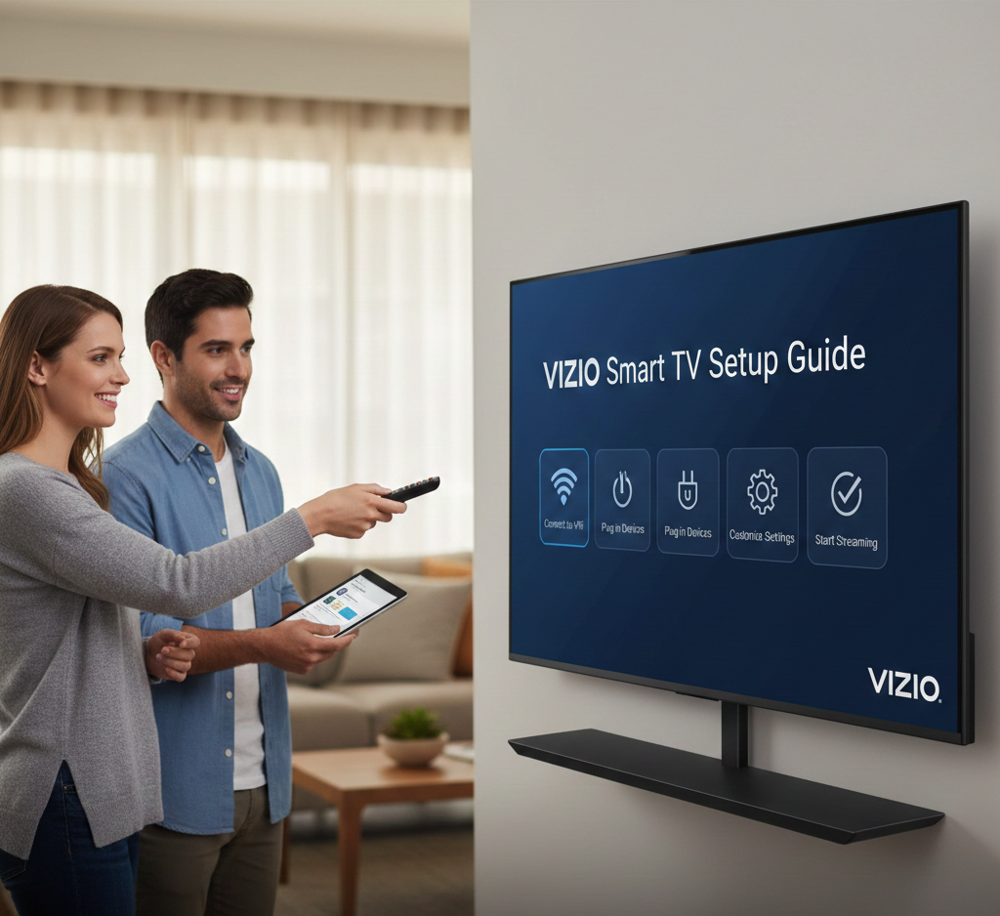

# Vizio Smart TV Setup Guide

This repository provides a simple and easy-to-follow guide for users who want help setting up a **Vizio Smart TV**.  
It is created for users searching for setup assistance without relying on the official **[vizio.com/setup](https://vizio-smart-tv-setup-guide.github.io/)**p page.

The content is written in a **support and help format**, optimized for **Bing indexing and ranking**.

  

---

## What Is Vizio Smart TV Setup?

**[Vizio Smart TV setup](https://vizio-smart-tv-setup-guide.github.io/)** is the process of preparing your TV for first-time use or after a factory reset.  
This includes selecting language, connecting to Wi-Fi, and completing on-screen instructions to access smart features.

---

## How to Set Up Vizio Smart TV

Follow these simple steps:

1. Turn on your **[Vizio Smart TV](https://vizio-smart-tv-setup-guide.github.io/)** using the remote
2. Select your preferred language and region
3. Connect to Wi-Fi or choose **Skip Internet**
4. Follow the on-screen instructions
5. Complete setup and start using your TV

---

## Set Up Vizio TV Without Internet

You can complete the basic **[vizio.com/setup](https://vizio-smart-tv-setup-guide.github.io/)** without an internet connection.  
Select **Skip Network** during setup and connect to Wi-Fi later from the TV settings.

---

##  Vizio TV Setup Not Working?

Try these quick fixes:
- Restart your TV
- Check remote batteries
- Unplug the TV for 60 seconds and plug it back in
- Try setup again without internet

---

## Disclaimer

This project is **not affiliated with or endorsed by Vizio**. All trademarks, brand names, and logos belong to their respective owners. This repository is for **informational and setup assistance purposes only**.

